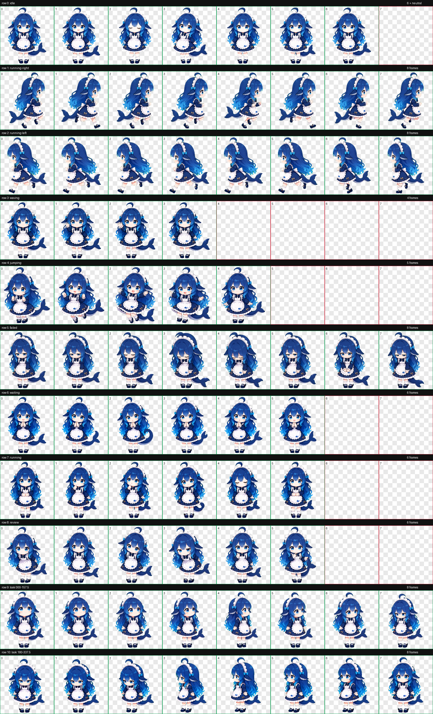

# DeepSeek娘 Codex Pet

一个可安装到 Codex Desktop 的非官方同人 Codex Pet。DeepSeek娘是一位蓝发鲸鱼女仆：性格可爱温柔、工作认真，失败时会有点慌张，并通过鲸鱼尾巴表达情绪。



## 特性

- Codex Pet v2 格式
- 9 组标准状态动画：待机、左右移动、挥手、跳跃、失败、等待、工作和审查
- 待机包含呼吸、眨眼、轻歪头和鲸尾摆动
- 工作状态使用托腮、抬眼、点头和鲸尾收放表现思考过程
- 16 个环视方向
- 透明背景 WebP 精灵图
- 已通过尺寸、逐帧、方向语义和连续性检查

## 安装要求

- 已安装支持自定义宠物的 Codex Desktop
- 安装时只需要仓库根目录中的 `pet.json` 和 `spritesheet.webp`

## Windows 一键安装

打开 PowerShell，依次执行：

```powershell
git clone https://github.com/xpy12367/codex-pet-DeepSeek-girl.git
Set-Location .\codex-pet-DeepSeek-girl

$deepseekPetDir = Join-Path $env:USERPROFILE ".codex\pets\deepseek"
New-Item -ItemType Directory -Force -Path $deepseekPetDir | Out-Null
Copy-Item .\pet.json, .\spritesheet.webp -Destination $deepseekPetDir -Force
```

以上命令会：

1. 从 GitHub 下载本仓库。
2. 创建 Codex 自定义宠物目录 `%USERPROFILE%\.codex\pets\deepseek`。
3. 将运行所需的两个文件复制到该目录。

确认安装文件存在：

```powershell
Get-ChildItem "$env:USERPROFILE\.codex\pets\deepseek"
```

正常情况下应看到：

```text
pet.json
spritesheet.webp
```

## 手动安装

1. 下载本仓库，或者在 GitHub 仓库页面选择 **Code → Download ZIP** 并解压。
2. 创建名为 `deepseek` 的宠物目录：
   - Windows：`%USERPROFILE%\.codex\pets\deepseek`
   - macOS/Linux：`~/.codex/pets/deepseek`
3. 将仓库根目录中的 `pet.json` 和 `spritesheet.webp` 复制到该目录。
4. 完全退出并重新启动 Codex Desktop。
5. 在 Codex 窗口右下角打开宠物选择器，选择 **DeepSeek娘**。

最终目录结构应为：

```text
.codex/
└── pets/
    └── deepseek/
        ├── pet.json
        └── spritesheet.webp
```

> 不需要把 `previews` 或 `qa` 复制到 Codex；它们仅用于展示和质量检查。

## 更新

如果使用 Git 克隆了仓库，请在仓库目录中执行：

```powershell
git pull

$deepseekPetDir = Join-Path $env:USERPROFILE ".codex\pets\deepseek"
Copy-Item .\pet.json, .\spritesheet.webp -Destination $deepseekPetDir -Force
```

复制完成后重新启动 Codex Desktop。

## 常见问题

### 宠物没有出现在选择器中

- 确认目录名是 `deepseek`。
- 确认 `pet.json` 和 `spritesheet.webp` 直接位于该目录中，而不是多嵌套了一层文件夹。
- 完全退出 Codex Desktop 后重新启动。

### PowerShell 提示找不到 `git`

请先安装 [Git for Windows](https://git-scm.com/download/win)，重新打开 PowerShell，然后再次运行安装命令。也可以使用上面的手动安装方法。

### 如何卸载

退出 Codex Desktop，然后删除以下宠物目录即可：

```text
%USERPROFILE%\.codex\pets\deepseek
```

## 包内容

- `pet.json`：宠物元数据，使用 `spriteVersionNumber: 2`
- `spritesheet.webp`：1536×2288、8×11 精灵图
- `previews/`：动作联系表、16 方向观察图和 9 个标准状态 GIF
- `qa/`：尺寸、透明边缘、逐帧、方向语义、盲测及连续性检查结果

## 说明

这是一个非官方同人项目，与 DeepSeek 官方无隶属或背书关系。
